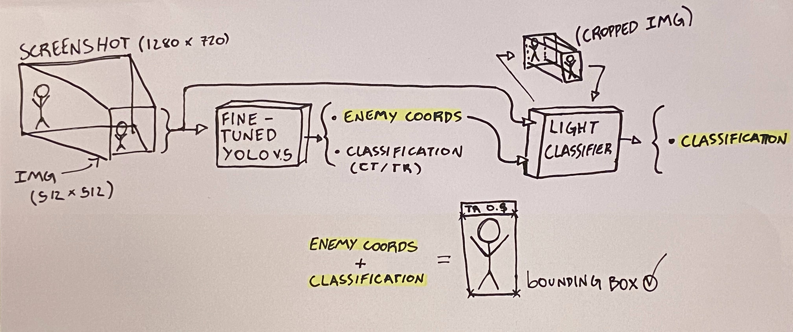
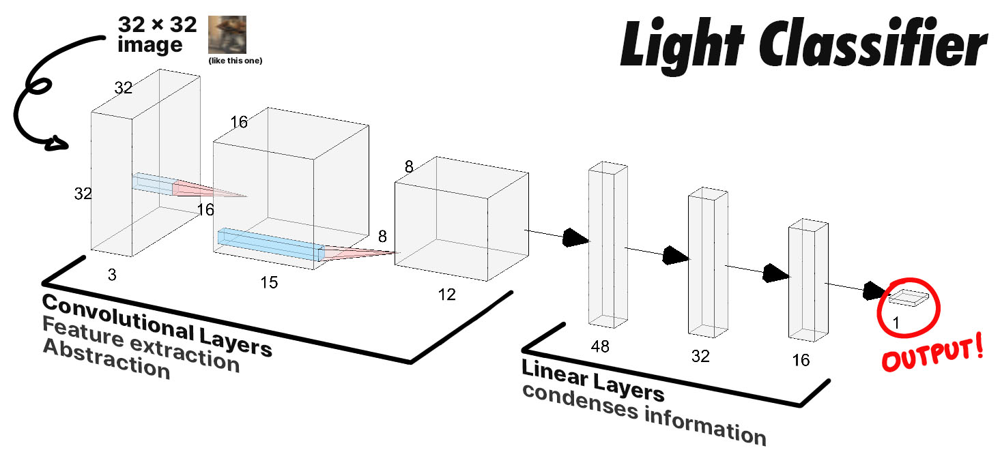

# Sequoia - a CS:GO AI detection bot.
[](https://www.python.org/) 
[](https://store.steampowered.com/app/730/CounterStrike_Global_Offensive/) 
[](https://en.wikipedia.org/wiki/Microsoft_Windows) 
[](https://en.wikipedia.org/wiki/X86) 
[](LICENSE)
<br>

A neural network for CounterStrike:GlobalOffensive character detection and classification. Built on a custom-made dataset, powered by the [csgo-data-collector](https://github.com/IgaoGuru/csgo-data) software.
This project was developed by [me](http://igorl.xyz), mentored by [Paulo Abelha](https://github.com/pauloabelha/). 

The project incorporates a fine-tuned version of [Ultralitic's YOLOv5](https://github.com/ultralytics/yolov5), while also using a secondary helper-NN for aiding in the classification task.  
After inference, the bounding boxes are processed by the **yolo_inference.py** file, and the mouse movement is calculated based on the distance from the crosshair (aim) to the enemy's location.

**DISCLAIMER: This software was developed with the intention of only being used in private matches, as a proof of concept, causing no harm to other player's experiences. If you wish to cheat in online matches, be aware that there are many other much more practical and efficient ways of doing so.**

## Prerequisites
* [Python 3.8.x](https://python.org) with additional libraries

    <details>
    <summary> list of required libraries:</summary>

    ahk>=0.11.1
    Cython
    matplotlib>=3.2.2
    mss>=6.1.0
    numpy>=1.18.5
    opencv-python>=4.1.2
    pandas>=1.1.5
    pillow
    PyYAML>=5.3
    scipy>=1.4.1
    tensorboard>=2.2
    torch>=1.6.0
    torchvision>=0.7.0
    tqdm>=4.41.0
    </details>

    After installing python, you can install all the necessary libraries with the following command:
        ```
        pip install -r requirements.txt
        ```

* **strongly recommended**: [CUDA Toolkit 10.2](https://developer.nvidia.com/cuda-10.2-download-archive?target_os=Windows&target_arch=x86_64&target_version=10&target_type=exelocal):
    CUDA is Nvidia's framework for high performance GPU computing. This software uses it to run the AI inside the GPU, instead of relying on the CPU, which is much slower. This means **you need an Nvidia GPU** to get the best possible performance out of the software.

## Neural Network Structure

I've drawn this sketch/diagram to illustrate the high-level structure of the AI.

First, the screenshot is taken from the `detect.py` file. After being reshaped into the appropriate dimensions (1, 3, 512, 512), it first goes into the fine-tuned YOLO v.5. After YOLO's processing, the 512x512 image is cropped using the coordinates given by the first NN. From there, the cropped image is resized into a 32x32 image enclosing only the player to be classified. The second NN (Light_Classifier) then returns the final classification results, and the coordinates from YOLO are combined with Light's classification to form the final, complete output.


This slightly more professional-looking diagram illustrates the architecture of the Light_Classifier. The input is a 32x32 image that encloses the player to be classified. It then passes through three convolutional blocks, each containing a 2d convolutional layer, followed by 2d Batch Normalization and a reLU function. In these three blocks, the network "decomposes" the original image into many smaller matrices that represent learned features of the original frame. These could be edges, colors, shapes and dimensions that the NN finds to be important for the task. The outputs of the last convolutional block are then flattened into a one dimensional array, and fed through a sequence of three linear layers, which will "condense" the information grasped by the convolutions into a single digit at the end, representing the acessed probability that the image analyzed is a CounterTerrorist (in this case, if the probability is < 50%, the NN believes the character to be a Terrorist). 

## Setting up for inference

If you want to test out the model, you can do so using the `detect.py` file. 

The default resolution for the game is **1280x720**, but you can change that by adding the "-x" and "-y" flags, then specifying the desired resolution by its x (e.g. 1280) and y (e.g. 720) components.
**Remember to always keep your game in the top-left corner of your monitor**
If you notice that the window's window bar is getting captured in the screenshot, you can change the y_offset of the capture by specifying the height of you window bar in pixels with the "-off" flag.


### YOLO's and Light's pretrained weights

YOLO was trained on **Google Cloud's compute engine** with a **12gb Tesla K80**. The dataset contained approximately **60k images**, and training took **15 epochs**. The YOLOv5-S pretrained model was used as the basis for finetuning. 

Light was trained on my local computer, with a **3gb gtx 1060**. The dataset contained approximately **60k images** (same as YOLO's), and training took **25 epochs**. The network was randomly initialized with seed **42**.

> If you leave the `-w` and `-wl` flags on `detect.py` empty, the standard weights will be loaded

### using the auto-shooting mechanic [WIP]

By default, auto-shooting is disabled because it is still in development, it's very slow and laggy at the moment. On the other hand, it's functional, so you might want to toggle it using the "-shoot 1" argument. This function has not been tested on other resolutions other than 1280x720, and if you know of a library/method that will emulate mouse movement faster than AHK, please reach me so I can implement it on the project.  

## Training on custom data

### Obtaining data

You will need a lot of data in order to fine-tune these models. Luckily, I've already taken care of that for you. You can use my [CS:GO Data-Collector](https://github.com/IgaoGuru/csgo-data) program. Everything about the dataset construction can be found in its own documentation.

### Training YOLOv5 and applying weights

If you wish to train YOLOv5 on your own dataset, you can follow [Ultralytics own tutorial](https://github.com/ultralytics/yolov5/wiki/Train-Custom-Data).

After obtaining your custom weights, you can specify the path to them with the "-w [insert path here]" argument when running `detect.py`.

### Training Light_Classifier and applying weights

The Light_Classifier takes advantage of the csgo-data dataset for training. After obtaining a dataset, you can specify its root path with the argument "-rp [path]" when calling the `light_classifier_train.py` file. 

You can run `light_classifier_train.py -h` to get a list of all the variables you may want to configure, and its respective flags - such as batch_size, dataset length, number of epochs, learning rate and others.

## Acknowledgments

* [Paulo Abelha](https://github.com/pauloabelha/), for lending me his experience and knowledge, and for enabling this project to exist.   

* [All of the team at Ultralytics](https://github.com/ultralytics), for developing such an awesome Neural Network, that was the backbone AI for the project.

* [Daniel Krupiński](https://github.com/danielkrupinski), for developing and maintaining the open-source  software that was used as the basis for my [CS:GO data collection program](https://github.com/IgaoGuru/csgo-data), which was crucial for the development of the project's dataset.

## License

> Copyright (c) 2020-2021 Igor Rocha

This project is licensed under the [GPL 3.0 License](https://opensource.org/licenses/GPL-3.0). 
